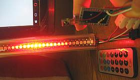
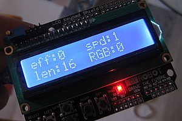
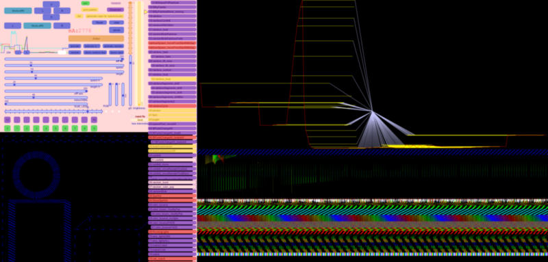
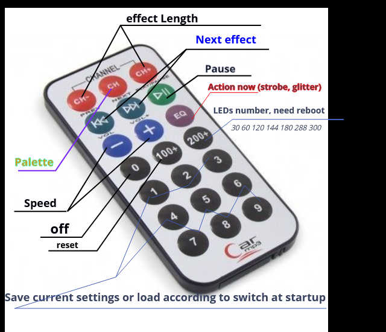
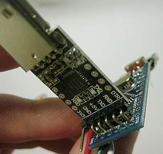

# Universal LEDController2812


~~Simple~~ The most universal and flexible controller for LED stripes with support of IR, WiFi, serial, keypad shield LCD, 3 or 5-buttons, USB control. Can use arduino on atmega, ESP8266, ESP32 with ws2812b ws2811 and other that is supported by FastLED library.
 Includes a lot of effects, tools to create collection and visualize it.

### if you have interesting effects or need some new - tell me

### Сoncept
There are save/load slots, many effects, each rich of settings.

You can build it with hardware options:
```C
//#define keypad1602 //free D0..3, D11..13, A1..
//#define IRkeypad	//3*7, ask me about support other types
//#define key5x		//all main options has button
//#define key3x		//central btn switch mode (settings). Side btns are +-, i.e. effN, speed, length, gamma
#define SerialControl //USB external GUI //! TODO software for android
//#define SerialSelect //enter effect № in terminal
//#define LCD2004_i2c						//A4 A5
```

* With IRkeypad:
At power up Switch between "settings"  (IR) and "working" (faster) modes.
Choose effect, each has many settings to customize. It saves last.
It save/load presets by press numbers buttons in  "settings mode" / "working mode".

* With keypad1602 or key3x: you have to press select button to select option (effect, speed, length, chennels), than change it with +- keys


* With SerialControl (USB, bluetooth): create presets in PC software, fast load it with buttons. Easy to test new effects


Saves are the first 10 effect slots (presets):
* slot 0 - auto-saved last used effect and settings. excluding № 248..255
* slots 1..9 you can manually save/load to EEPROM
* slot 10 off
* slots 11...247  constant links to effect and settings set for it
* slot 248 endless different effect switch (when change effN in reverse direction) (so if your customer ask about over 9000 effects - you can use this :)
* slot 249 random
* slot 250 () random demo and animated
* slot 251 animate to settings in slot 1
* slot 252 () animate 
* slot 253 predefined show sequence  //TODO
* slot 254 () random demo fast
* slot 255 () random demo

### Hardware and reference design:

pro mini or other

VS1838 (pins: D6, GND, VCC)

switch (pins: A4, GND)

LED stripe of WS2812  (pins: D2, GND)

3x7 IR keypad


### Characteristics

power on 5v (VCC) can be as low as 3.3v LED also working.

atmega168 for 60-150 LEDs, main effects

atmega328 for 120-320 LEDs, all not heavy effects

atmega2560 for 1000-1200 LEDs, all effects

Some effects and test modes eat a lot of memory - disable it and use "#define saveMem" to use atmega168

### basic instructions
0. Assemble the device
1. Install USB-COM programmer driver e.g. CP2102
2. use lightweight portable HEX uploader http://xloader.russemotto.com or compile from source

3. Choose hex, port, type of controller 168/328/.. Upload
4. Connect to stripe.
### Cautions
* Don't power stripe (e.g. longer than 15px with White light LEDs) through USB-programmer-controller boards. Disconnect "+" wire beetween stripe and controller or use separate power while connectiong USB
* Check + - and max 5v .
* Bad PSU can adds 1v noise to 5v output, so if you have to use cheap one - add diode (with enought power rating 1A-2-5-10A) to + wire so it down voltage a bit or use down DC-DC.
* Connect power AFTER all assembled with good GND wire connection
* Don't see on bright Blue LEDs (or white because it is from Blue) while testing if you need your eyes for a long life. Use diffuser, dim power, itc.
### Hints
* to maintain max quality (bit depth) regulate brightness not by program but via DC-DC down modules like XL4005 (without current limit)
* Brownout and other power problems add capacitor on power in and 3,3V output of LDO, change USB diode with low voltage drop diode https://github.com/nkolban/esp32-snippets/issues/168

### notable features
*💎 save/load, quick access slots
*💎 ESP8266 support
*💎 color by music or other input sensors
*💎 plot power, power by color chennels, leds
* lightweight binary Serial protocol and UDP WIFi
*💎 send LEDs data or control over WiFi with external MCU's dedicated for rendering pixels
*💎 test effects and LEDs constructions (how it looks like in circle or cube) without LED stripes or without MCU at all.

### TODO
*🐛 fix  NUM_LEDS>255  rand8, itc
*🐛 fix last uncommented case in GUI not appears
* rewrite printPalette as usual PX

* map action to btn, save selected
* change effects to new settings available
* SerialControl BlueFilter
* animate demo - setings range related to eff
* delay(){  input ,  FastLED.delay}
* wemos-Xi
* STM32
* ESP32
* wifi android
* uniform speed of effects
* implement colorize function, lengthH, speedH, set main gColor and BG colors. Rewrite effects that use existing settings for it.
* save to file
* reorder
* group effect related to (circular) stripe ring
*🐛 fix g4p clicks (with movement | drag) if author would update it
* not clear whole stripe with FastLED.clear() in effect that use it while NUM_LEDS adj mode
"//!" - in code this mean need to write new, recheck of fix existing
* add support of multiple lists, not only switch_slot.h
* fill switch_slot.h with newline to see free space

* fix UI aligment
*🐛 fix UI glitches
